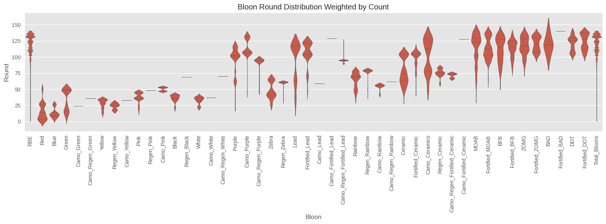
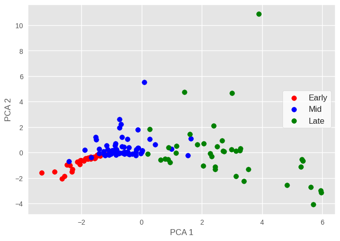
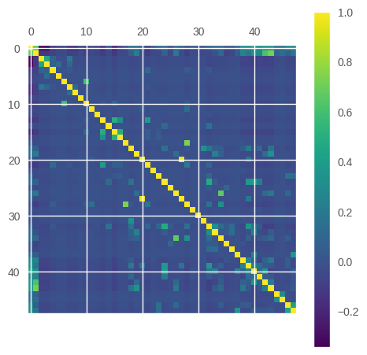
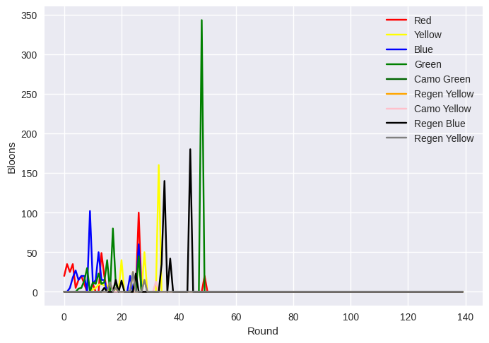
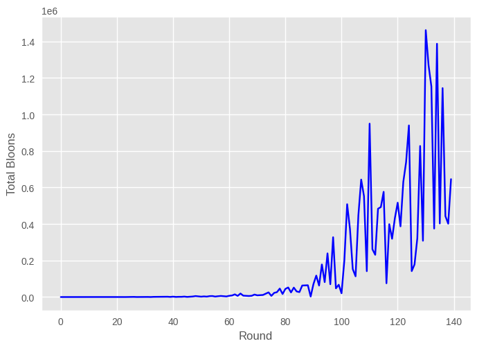

# Quick Links
- [Overview](#overview)
- [Intro](#Intro)
- [EDA](#exploratory-data-analysis)
- [Dataset (Kaggle)](https://www.kaggle.com/datasets/brandonconrady/bloons-tower-defense-6-rounds-1140)

# Overview

# Intro

The main 2 concepts used in this analysis is expanding data for weighting (so we can use a violin plot) and Principal Component Analysis. We do this to analyze the combination of bloon type and round number. We find some interesting results, especially for the PCA part. This dataset gives us the info on the rounds from 1-140 of the bloon types and their counts per round.

# Exploratory Data Analysis

We first made a simple frequency plot of the bloons to give us an idea of the data, and to see if these frequencies align with our expectations.

We then made a correlation matrix, which showed us that there are very highly correlated bloon types, meaning that some combinations of bloons show up in quite similar rounds.

Next we looked at the total bloons frequency. To do this, we made a sum column column in our dataset.

Now that we have a general consensus of our data, lets dive deeper. Our goal here is to give us info on the frequencies of our bloons throughout the rounds 1-140 and compare it to other bloons. In simple terms, we want to see the distributions of each bloon type. A good way to do this is to use a violin plot.

To do this, I created a melted dataset from the data, where our columns were now round, bloon type, and count. This created us a dataframe that focused in on all the combination of bloon type and round with the associated count.

How a violin plot typically works is that how wide a plot point goes out is measured by the amount of datapoints that are a specific combination of bloon type & round, but we want the it to be measured by our count column. A way to do this is to expand our dataset so a data row will be repeated 'count' times - this will give us an extremely huge dataframe, but it is a way of going about this problem. This makes it so the amount of datapoints for a specific combination of bloon type & round is the same as the count.

<pre>
column_names = bloons.columns.tolist()
column_names.remove('Round')
column_names.remove('Total_Bloons')

bloons_melted = pd.melt(
    bloons,
    id_vars='Round',
    var_name='Bloon',
    value_name='Count'
)

print(bloons_melted)

bloons_expanded = bloons_melted.loc[bloons_melted.index.repeat(bloons_melted['Count'])].copy()
print(bloons_expanded)

plt.figure(figsize=(16, 6))

sb.violinplot(data=bloons_expanded, x='Bloon', y='Round', scale='width', inner='quartile')
</pre>

Next, lets get an idea of the "structure" of a round given by the bloon type counts. Let's use PCA to make our dimensionally-high dataset into something that we can visualize. In short, we do dimensionality reduction to get an idea of our data structure. We also scaled our data in the process.

